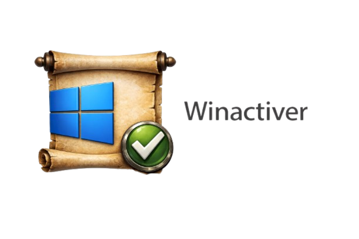

  

<h1 align="center">WinActiver</h1>

  
  
  
  

---

## 📌 Descripción

**WinActiver** es una herramienta de **activación automática** para sistemas **Windows 10 y Windows 11**, diseñada para simplificar el proceso de activación utilizando **claves KMS** compatibles.

El proyecto se enfoca en automatizar la verificación del estado de activación del sistema y aplicar la licencia correspondiente de manera directa, reduciendo la necesidad de configuraciones manuales o conocimientos técnicos avanzados por parte del usuario.

WinActiver está desarrollado en **Python**, con un enfoque ligero, claro y funcional.

---

## ⚙️ Funciones

- ✅ Compatible con **Windows 10** y **Windows 11**
- 🔑 Usa **claves KMS genéricas** para activación
- 🔍 Detección automática del estado de activación
- ⚙️ Proceso de activación automatizado
- 🧠 Uso sencillo y directo
- 📦 Herramienta ligera y enfocada
- 🐍 Desarrollado en **Python**

---

## 📄 Licencia

Este proyecto se distribuye bajo la licencia:

**Creative Commons Attribution-NonCommercial-NoDerivatives 4.0 International  
(CC BY-NC-ND 4.0)**

- ✔️ Uso permitido con atribución
- ❌ Uso comercial no permitido
- ❌ No se permiten modificaciones ni trabajos derivados

---
## ⚖️ Disclaimer Legal

⚠️ **ADVERTENCIA IMPORTANTE:**

- Solo use en **sistemas de los que sea propietario**
- **No distribuya** software modificado ilegalmente
- Respete los **términos de licencia de Microsoft**
- El autor **NO se hace responsable** por mal uso o daños

📜 **Legalidad:** Las claves KMS usadas son genéricas y públicas, publicadas por Microsoft para uso en entornos empresariales legítimos.

